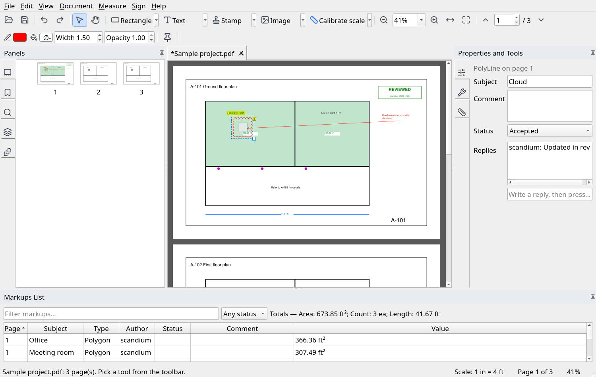
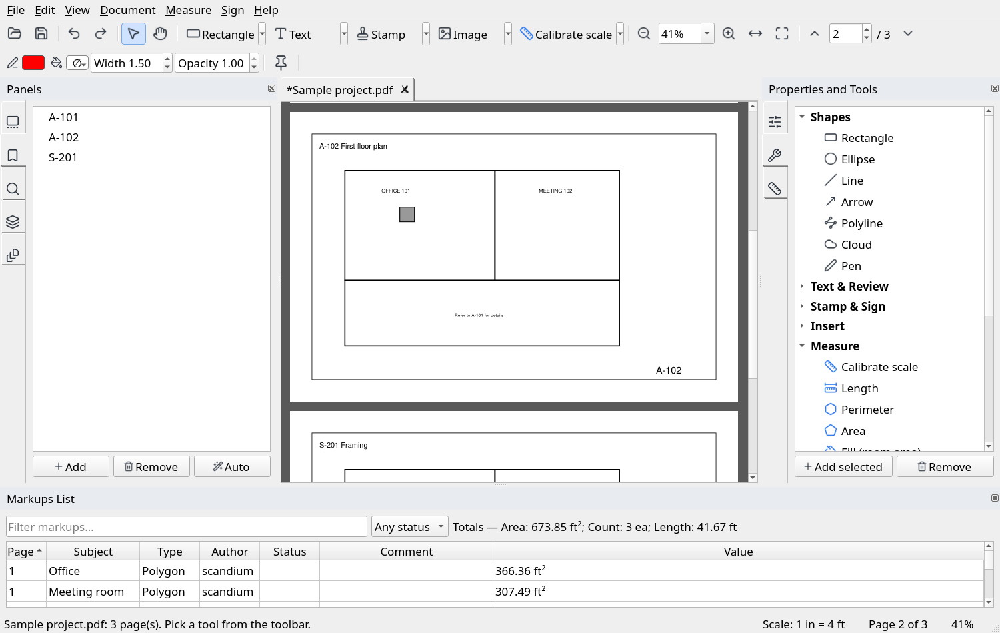
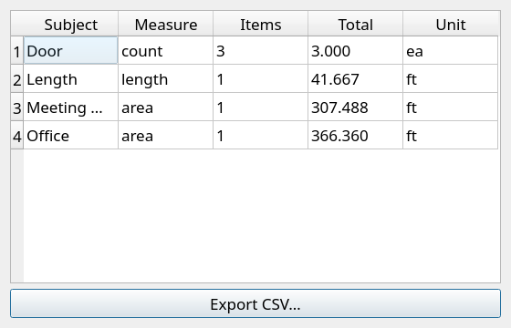
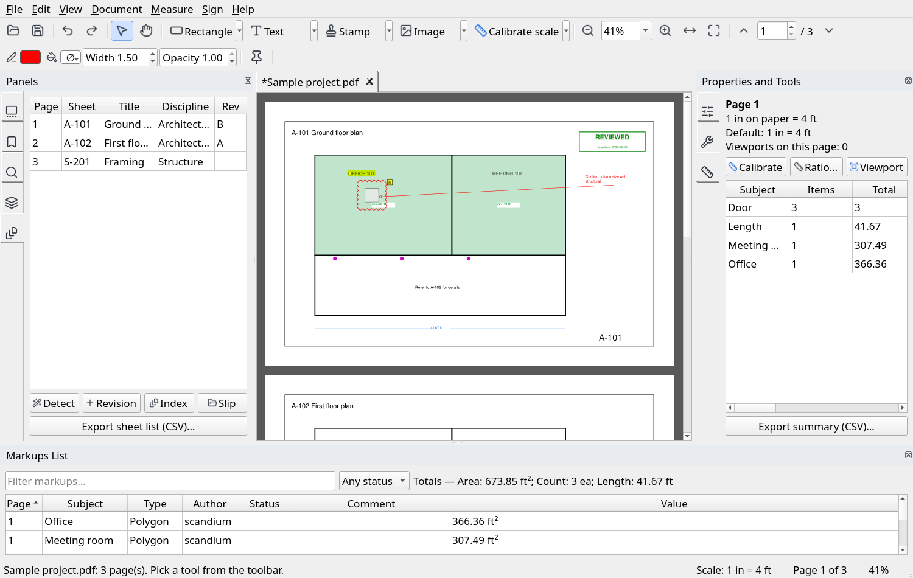

# OpenRevu

OpenRevu is a free PDF tool. You use it to mark up drawings, measure quantities, and review documents.
It runs on Linux, macOS, and Windows. Its workflow follows Bluebeam Revu.

OpenRevu is not connected to Bluebeam, Inc.



## Status

OpenRevu is a beta. It is not a full replacement for Bluebeam Revu.
Read the section "Known limits" before you use it for important work.

- The automatic tests pass on Linux, macOS, and Windows.
- The packaged program starts and passes a self-test on all three systems.
- Nobody has used the window by hand on macOS or Windows.
- Test the software on your own files before you depend on it.

## Install

### Packaged program (no Python needed)

Download the file for your system from the [Releases](https://github.com/vineetpadia/openrevu/releases) page.
Unpack it and start `OpenRevu`. The macOS and Windows programs are not code-signed,
so the system can show a warning the first time.

### From source

You need Python 3.9 or later.

```
pip install -e .[test]
```

This command installs PyMuPDF and PyQt5. It also installs the optional packages for signatures and room fill.

Some functions need extra software:

| Function | What you need |
|---|---|
| OCR | The `tesseract` program on your PATH. Tested with version 5.5. |
| PDF/A export | The `gs` (Ghostscript) program on your PATH. Tested with version 10.07. |
| PDF/A check | The `verapdf` program on your PATH. Tested with version 1.31. |
| Room fill | `numpy` and `scipy`. Install them with `pip install openrevu[fill]`. |
| Digital signatures | `pyhanko`. Install it with `pip install openrevu[sign]`. |

## Start

Open the window:

```
openrevu drawing.pdf
```

You can open more than one file. Each file opens in its own tab.
You can also drag a PDF onto the window.

Run a batch command without the window:

```
openrevu-cli --help
```

Show the version, or check that the program works without a window:

```
openrevu --version
openrevu --selftest
```

Run the tests:

```
pytest
```

The tests do not open a visible window.

## Window layout

The window follows the Revu workflow.

| Part | What it does |
|---|---|
| **Start page** | Shows when no file is open. Use it to open a file or pick a recent file. |
| **Toolbar** | Open, save, undo, redo, Select, Pan, tool groups, zoom, and page buttons. |
| **Tool groups** | **Shapes**, **Text & Review**, **Stamp & Sign**, and **Measure**. Each button remembers the last tool that you used. Click the arrow to see all tools in the group. |
| **Properties toolbar** | Line colour, fill colour, width, and opacity. It changes the selected markup. If no markup is selected, it sets the values for new markups. |
| **Left panel** | Thumbnails, Bookmarks, Search, and Layers. |
| **Right panel** | Properties, Tool Chest, and Measurements. |
| **Markups List** | A table of all markups, below the page. |
| **Status bar** | Shows the scale of the page, the page number, and the zoom. |

Point to an icon to see its name and shortcut.

## Basic use

1. Open a PDF.
2. Pick a tool in the toolbar or in the **Tool Chest** panel.
3. Click or drag on the page.
4. The tool returns to **Select** after each markup. Click the pin icon (**Keep tool**) to stay in the tool.
5. To change a markup, click it. Drag it to move it. Drag the square handle to resize it.
6. Right-click a markup to copy it, delete it, set its status, or reply to it.
7. Press **Ctrl+S** to save.

Press **Ctrl+Z** to undo and **Ctrl+Y** to redo. OpenRevu keeps the last 30 steps.

| Key | Tool | Key | Tool |
|---|---|---|---|
| V | Select | T | Text |
| H | Pan | O | Callout |
| R | Rectangle | N | Note |
| E | Ellipse | I | Highlight |
| L | Line | S | Stamp |
| A | Arrow | M | Length |
| Y | Polyline | K | Count |
| C | Cloud | F | Room fill |
| P | Pen | | |

The **Insert** group has **Image**, **Snapshot** (copies a region to the clipboard as a picture),
**Copy text** (copies the text under a region), and **Link**.
Click a link with **Select** or **Pan** to follow it. Page links and web links are followed.
Links to files and programs are never opened.

### Measure a drawing

1. Pick **Calibrate** (the ruler icon in the **Measure** group). Drag across a dimension that you know.
2. Enter the real length and the unit.
3. Pick **Length**, **Area**, or another measure tool.
4. For a polyline or a polygon, click each point. Double-click to finish.
5. Open **Measurement summary** to see the totals.

You can also set the scale as a ratio. Use the menu **Measure > Set scale by ratio**, or the **Measurements** panel.
The status bar always shows the scale of the current page.

To measure a room, pick **Fill** and click inside the room. OpenRevu finds the walls.
It removes columns and other solid objects from the area.
The walls must form a closed shape. If there is a gap, OpenRevu shows an error.





## Features

### View

- Start page with recent files
- Tabs for many documents
- Continuous scroll, zoom, and fit to width
- Page thumbnails and bookmarks
- Text search with highlighted results
- Password-protected files
- Printing

### Markup

- Rectangle, ellipse, line, arrow, polyline, and revision cloud
- Freehand pen
- Highlight, underline, strikeout, and squiggly underline
- Text box, callout, and note
- Stamps with name and date, and image stamps
- Visual signature
- Redaction marks
- Pictures (**Image** tool)
- Links to a page or a web address (**Link** tool)

A markup is a standard PDF annotation. Other PDF viewers can show it.
OpenRevu stores its own data (measurement values, scales, and review status) in custom keys.
Other viewers ignore these keys.

### Edit

- Select, move, resize, and delete a markup
- Copy, paste, and duplicate (shapes, lines, pens, and text boxes)
- Right-click menu
- Change color, fill, width, opacity, subject, and comment in the **Properties** panel
- Undo and redo

### Review

- Set a status: Accepted, Rejected, Cancelled, Completed, or Reviewed
- Add replies to a markup
- Sort and filter the **Markups List**
- Add your own columns to the list (text, number, or choice). Edit the values in the **Properties** panel.
  Right-click the list header to add or remove a column.
- Export the list to a CSV file
- Make a **Markup Summary**: a PDF report with a picture, comment, replies, status, measurement,
  and custom values for each markup (**File > Export Markup Summary**)

### Measure

- Scale by calibration or by ratio
- A separate scale for each page
- A separate scale for one area of a page (a viewport)
- Length, polyline length, perimeter, and area
- Area with cut-outs, rectangle area, and ellipse area
- Room area with the **Fill** tool
- Volume (area multiplied by depth)
- Diameter and angle
- Counts, grouped by name
- Resize a measurement. OpenRevu measures it again. Cut-outs scale with their area.
- Lengths in feet and inches, for example `12' 6 1/2"` (**Measure > Show feet and inches**)
- Measurement summary and CSV export

### Tool Chest

Save a markup as a preset. Place the preset on any page later. OpenRevu stores presets in a JSON file.

### Sheets

The **Sheets** panel keeps a record for each page: sheet number, title, discipline, and revision history.
The record is stored in the PDF, on the page. It stays with the page when you move, delete, or save pages.

- **Detect** finds the sheet numbers and titles from the text size. You can edit every value in the table.
- **Revision** adds a revision (name, date, description) to the selected sheets.
- **Index** inserts a sheet index page with a link to each sheet.
- **Slip** replaces sheets with a new version of the drawings. OpenRevu pairs the sheets by sheet number
  (or by page position). The markups, links, bookmarks, scales, and revision history stay with the new sheet.
  Sheets that are only in the new file are added at the end.
- Make a bookmark for each sheet, and a link from each sheet reference (for example "see A-102") to its page.



The command `openrevu-cli sheets` makes the bookmarks and links in a batch.

### Pages

- Insert a blank page, a PDF, or an image
- Delete, rotate, move, and crop pages
- Extract pages, split a document, and merge documents
- Set page labels

### Document

- Header and footer. You can use `{page}`, `{pages}`, and `{date}`.
- Text watermark and image watermark
- Bates numbers
- Flatten (put markups into the page)
- Permanent redaction of text, images, and line art
- OCR text layer
- Document properties
- Form fields: create, list, and fill
- Show and hide layers
- Comparison of two versions of a drawing set (see below)
- PDF/A export (see below)
- File size optimization
- AES-256 encryption

### Compare two versions

**Document > Compare with another PDF** pairs the sheets by sheet number, or by page position.
It reports each sheet as changed, unchanged, added, or removed. For a changed sheet it shows:

- the share of the drawing that changed. A difference of one pixel is ignored.
- the words that were added and removed.

It also makes an overlay PDF (red = only in the old version, blue = only in the new version)
and a CSV report. The command `openrevu-cli compare` does the same.

### PDF/A

**File > Export as PDF/A** makes a PDF/A-1b, 2b, or 3b copy with Ghostscript. If veraPDF is installed,
OpenRevu checks the copy and shows the result. OpenRevu never says that a file is PDF/A on its own.
It reports only what veraPDF says. Markups are flattened into the pages.
PDF/A-1 does not allow transparency. OpenRevu mixes semi-transparent markups with white. If a page
still loses its selectable text, the report says so. Use level 2b in that case.

### Tool Chest from Bluebeam

**File > Import Bluebeam tool set (.btx)** adds the tools of a Bluebeam tool set to **My Tools**.
OpenRevu reads shapes, lines, arrows, clouds, pens, text boxes, callouts, and notes.
It lists the tools that it cannot read (for example stamps), with the reason.

> The `.btx` format is not documented by Bluebeam. OpenRevu reads it from the description of the Bluebeam
> community, and the tests use files built to match that description. It has not been checked against files
> from every Bluebeam version. If an import fails on a real file, please open an issue.

### Autosave and recovery

OpenRevu saves a copy of each document that has unsaved changes every minute. If the program closes
unexpectedly, it offers to restore these documents the next time you start it. A copy of a
password-protected file is encrypted. OpenRevu removes the copy when you save or close the document.

### Signatures

- Sign a PDF with a PKCS#12 certificate
- Check a signature against the trusted certificates that you supply

Use the field `verdict_ok` to decide if a signature is good.
It is true only when the signed data is unchanged, the signature is correct,
the certificate is trusted, and nobody changed the file after signing.

### Batch commands

`openrevu-cli` has these commands:

`merge`, `split`, `watermark`, `flatten`, `optimize`, `redact`, `ocr`, `encrypt`, `csv`, `summary`,
`compare`, `numbering`, `footer`, `sheets`, `report`, `pdfa`, `run`

Use `--in-password` when the input file has a password.

### Scripts

You can write your own automation in Python. The command `run` opens the input file, runs your script, and saves the result to the output file.
The script gets a variable named `doc`.

```
openrevu-cli run input.pdf output.pdf add_counts.py
```

Example script `add_counts.py`:

```python
doc.add_count(0, (100, 200), group="Door")
doc.watermark("DRAFT")
```

You can also import the library:

```python
from openrevu.core import Document

doc = Document("input.pdf")
doc.add_length(0, [(0, 0), (100, 0)])
doc.save("output.pdf")
```

All coordinates are in points (1/72 inch). The origin is the top-left corner of the page as you see it.
This is also true for rotated and cropped pages.

## Known limits

OpenRevu does not have these functions:

- **Real-time collaboration.** Studio Sessions and Projects need a server. OpenRevu works on local files.
  To share a review, send the PDF. Use the status, the replies, the Markup Summary, and the CSV export.
- **A full Bluebeam tool-set import.** Only the `.btx` tool sets are read (see above), not `.bpx` or `.bax` files.
- **Revision tracking across files.** The Sheets panel stores the revision history in the PDF.
  There is no database that spans many files.

OpenRevu has these limits:

- Comparison works on rendered pixels and words. It does not understand the drawing. It is slow on very large sheets.
- The **Fill** tool needs a closed boundary. A curved wall becomes many short straight segments.
- A count marker has a fixed size. You cannot resize it.
- Highlight, underline, and strikeout markups, stamps, and measurements cannot be copied or saved as tools.
- OpenRevu keeps the undo history in memory. The history of a password-protected file is encrypted.
  When you close a tab, the history is lost.
- Signature checks use only the certificates that you supply. OpenRevu does not use the system trust store.
  It does not check for revoked certificates.
- The packaged programs do not include Tesseract, Ghostscript, or veraPDF.
- Nobody has done a usability study of the window, and nobody has used it by hand on macOS or Windows.

## Contribute

Run `pytest` before you send a change. Add a test for each fix or new function.
To make the screenshots again, run `python docs/make_screenshots.py`.

## Credits

The icons come from [Lucide](https://lucide.dev) (ISC licence). The licence text is in `openrevu/icons_svg/LICENSE-lucide.txt`.

## Licence

OpenRevu uses the AGPL-3.0-or-later licence. The PyMuPDF library requires this licence.
